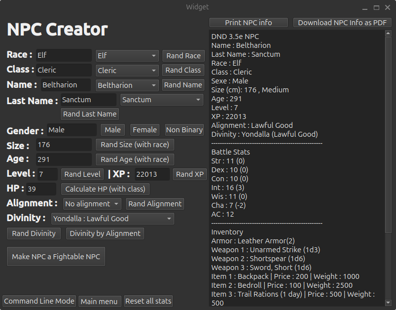
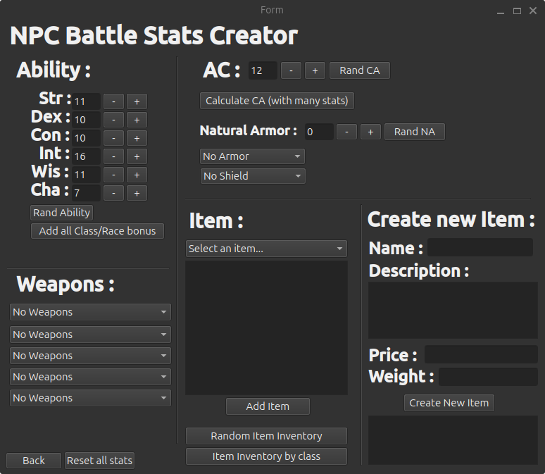
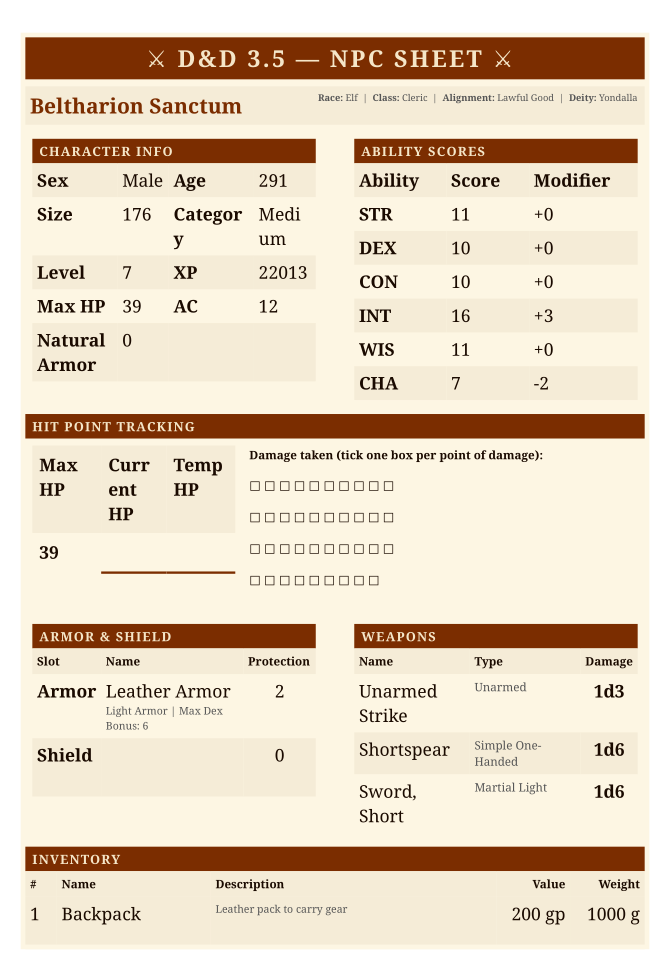
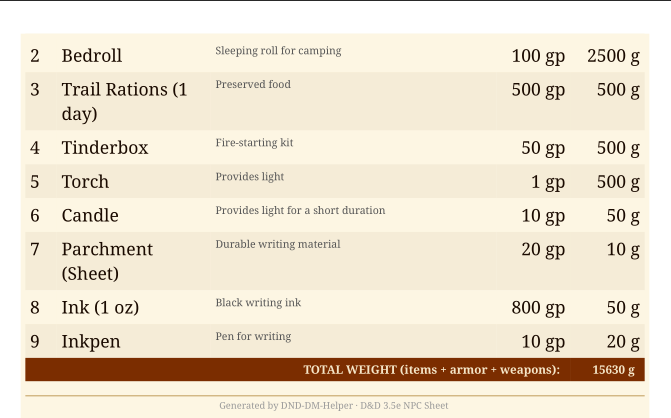

# GM Campaign Creation Helper

## Description

This tool is designed to help you create your **D&D 3.5e** campaign or mission.
It has both a **GUI mode** and a **Command Line mode**.

> **Note:** To use Command Line mode, you must launch the tool from a Terminal (Linux) or Command Prompt (Windows).

```bash
./DND_MG_Helper_GUI-v'version'-'yourOS'
```

It can generate **NPCs** as PDF files, including the following attributes:

- Race, Class, Sex, Age
- First Name, Last Name
- Size and Size Category
- Level and XP
- Alignment and Divinity
- Ability Scores
- Armor Class (AC), broken down by:
  - Natural Armor
  - Armor
  - Shield

---

## Screenshots

### NPC Creator — Main Window


The main window lets you set or randomize every attribute of your NPC: race, class, name, gender, size, age, level, XP, alignment, and divinity. A live preview on the right shows the full NPC stat block as it is built.

### NPC Battle Stats Creator


The battle stats window lets you configure ability scores, armor class, natural armor, armor, shield, weapons (up to 5 slots), and inventory items. You can also create custom items on the fly using the **Create New Item** panel.

### Generated NPC Sheet — Page 1


The generated PDF sheet includes a full character info block, ability scores with modifiers, a hit point tracking section with damage tick boxes, armor & shield details, weapons, and the start of the inventory.

### Generated NPC Sheet — Page 2


The second page continues the inventory list and shows the total weight of all items, armor, and weapons combined.

---

## Building the Executable

> You can skip this section if a working executable is already present in `/Executable/yourOS`.

### Linux

**1. Install dependencies**
```bash
sudo apt install git cmake qt6-base-dev qt6-tools-dev qt6-tools-dev-tools libyaml-cpp-dev libxcb-cursor0
```

**2. Clone the repository**
```bash
cd ~/Documents
git clone https://github.com/sanjamillo2010-dotcom/DND-DM-Helper.git
cd DND_MG_Helper_GUI
```

**3. Open in Qt Creator**
- Open Qt Creator
- Go to **File → Open File or Project**
- Navigate to the cloned folder and open `CMakeLists.txt`
- Click **Configure**

**4. Build and run**
- Click the hammer icon to build
- Click the green play button to run

**5. Create a shareable executable**
```bash
# Copy the executable and config folder to your Desktop
cp build/Desktop-Debug/DND_MG_Helper_GUI ~/Desktop/
cp -r conf/ ~/Desktop/conf/
chmod +x ~/Desktop/DND_MG_Helper_GUI

# Run it
~/Desktop/DND_MG_Helper_GUI
```

> Keep the `conf/` folder in the same directory as the executable. Both are required for the tool to work correctly.

**6. Optional — Build a Flatpak for wider sharing**
```bash
flatpak remote-add --if-not-exists flathub https://flathub.org/repo/flathub.flatpakrepo
flatpak install flathub org.kde.Platform//6.7 org.kde.Sdk//6.7
flatpak-builder --repo=myrepo --force-clean build-flatpak com.sanja.DND_MG_Helper.yaml
flatpak --user remote-add --no-gpg-verify myrepo myrepo
flatpak --user install myrepo com.sanja.DND_MG_Helper
flatpak run com.sanja.DND_MG_Helper
```

---

### Windows

**1. Install dependencies**
- **Qt**: Download from https://www.qt.io/download-qt-installer (free — select Qt 6.7 + Qt Creator during installation)
- **Git**: Download from https://git-scm.com
- **CMake**: Download from https://cmake.org

**2. Clone the repository**
```cmd
cd C:\Users\YourName\Documents
git clone https://github.com/sanjamillo2010-dotcom/DND-DM-Helper.git
cd DND_MG_Helper_GUI
```

**3. Install yaml-cpp via vcpkg**
```cmd
git clone https://github.com/microsoft/vcpkg.git
cd vcpkg
bootstrap-vcpkg.bat
vcpkg install yaml-cpp
vcpkg integrate install
cd ..
```

**4. Open the project in Qt Creator**
- Open Qt Creator
- Go to **File → Open File or Project**
- Navigate to the cloned folder and open `CMakeLists.txt`
- Click **Configure** when prompted

**5. Point CMake to vcpkg**
In Qt Creator, go to **Projects → Build → CMake Configuration** and add:
```
CMAKE_TOOLCHAIN_FILE=C:/path/to/vcpkg/scripts/buildsystems/vcpkg.cmake
```

**6. Build and run**
- Click the hammer icon to build
- Click the green play button to run

**7. Create a shareable executable**
Open the Qt command prompt (search **"Qt 6.7 MinGW"** in the Start menu) and run:
```cmd
cd C:\Users\YourName\Documents\DND_MG_Helper_GUI\build\Desktop-Debug\DND_MG_Helper_GUI
windeployqt DND_MG_Helper_GUI.exe
```
Copy the entire `Release` folder along with your `conf/` folder to share the application.

---

## Configuration

All configuration files are located in the `/conf` directory. You can customize the tool's behavior by editing these YAML files — no recompilation is required.

---

### `NPC_conf.yaml`

This file controls everything related to NPC generation.

#### Adding or Removing Races

Races are listed under the `race` key. To add a new race, add its name to the list and create a corresponding block with the following fields:

```yaml
race:
  - Human
  - Elf
  - MyNewRace       # <-- Add the name here

MyNewRace:
  usualNames:
    - Name1
    - Name2
  MaxSize: 180      # Maximum height in cm
  MaxAge: 100       # Maximum age in years
```

To remove a race, delete its name from the `race` list **and** delete its corresponding block. Leaving one without the other may cause errors.

#### Adding or Removing Classes

Classes are listed under the `Classtype` key. To add a new class, add its name to the list and create a block with the following fields:

```yaml
Classtype:
  - Fighter
  - MyNewClass      # <-- Add the name here

MyNewClass:
  usualLastNames:
    - Lastname1
    - Lastname2
  HPdice: 8         # Hit die (e.g. 4, 6, 8, 10, or 12)
  HasLightArmor: true
  HasMidArmor: false
  HasHeavyArmor: false
  HasShild: false
  Hastarge: false
  Hassimple_light: true
  Hassimple_one_handed: true
  Hassimple_two_handed: false
  Hassimple_ranged: true
  Hasmartial_light: false
  Hasmartial_one_handed: false
  Hasmartial_two_handed: false
  Hasmartial_ranged: false
  Hasexotic_light: false
  Hasexotic_one_handed: false
  Hasexotic_two_handed: false
  Hasexotic_ranged: false
  Inventory:
    - backpack
    - bedroll
    - torch
```

Set each `Has...` field to `true` if the class is proficient with that armor or weapon category.

Inventory items must match keys defined in `Item_conf.yaml`.

#### Adding or Removing Names and Last Names

- Names are defined per race under `usualNames`.
- Last names are defined per class under `usualLastNames`.

Simply add or remove entries from the relevant list.

#### Adding or Removing Divinities

> ⚠️ **Known Bug:** Adding or removing divinities currently causes the program to crash. This will be fixed in **v1.3.2**. Do not edit the `Divinite` list or `DivinityDetails` block until the fix is released.

---

### `Armor_conf.yaml`

This file defines all available armors and shields.

#### Adding a New Armor

Add the armor key to the appropriate list under `Armors_list` (e.g. `light_armor`, `mid_armor`, `heavy_armor`, or `shild`), then add its definition under `Armors`:

```yaml
Armors_list:
  light_armor:
    - my_new_armor    # <-- Add the key here

Armors:
  my_new_armor:
    Name: "My New Armor"
    Prix: 3000          # Price in copper pieces
    Prot: 3             # Armor Class bonus
    MaxDEX_Bonus: 5     # Maximum Dexterity bonus allowed
    Poids: 8000         # Weight in grams
    Type: "Light Armor" # Must match the category: "Light Armor", "Mid Armor", "Heavy Armor", or "Shild"
    isShild: false
    asIron: true        # true if the armor contains iron (relevant for druids and some spells)
```

#### Removing an Armor

Remove the key from `Armors_list` **and** delete its block under `Armors`.

---

### `Weapon_conf.yaml`

This file defines all available weapons.

#### Adding a New Weapon

Add the weapon key to the appropriate category list under `Weapon_list`, then add its definition under `Weapons`:

```yaml
Weapon_list:
  martial_one_handed:
    - my_new_sword    # <-- Add the key here

Weapons:
  my_new_sword:
    Name: "My New Sword"
    Num_of_Dice: 1      # Number of damage dice
    Dice_Value: 8       # Size of each die (e.g. 6 = d6, 8 = d8)
    Prix: 2000          # Price in copper pieces
    Poids: 2000         # Weight in grams
    Type: "Martial One-Handed"
```

If the weapon should only be available to specific classes (like Bard, Druid, Monk, Rogue, or Wizard), also add it to the relevant list under `Weapon_list_class_specifique`.

#### Removing a Weapon

Remove the key from `Weapon_list` (and from `Weapon_list_class_specifique` if applicable), then delete its block under `Weapons`.

---

### `Item_conf.yaml`

This file defines all items that can appear in NPC inventories.

#### Adding a New Item

Add the item key to `Item_List`, then add its definition under `Items`:

```yaml
Item_List:
  - my_new_item     # <-- Add the key here

Items:
  my_new_item:
    Name: "My New Item"
    Description: "A brief description of the item"
    Prix: 500         # Price in copper pieces
    Poids: 250        # Weight in grams
```

Once added, you can reference the item by its key in any class `Inventory` list inside `NPC_conf.yaml`.

#### Removing an Item

Remove the key from `Item_List` and delete its block under `Items`. Also remove it from any class `Inventory` lists in `NPC_conf.yaml` that reference it.
